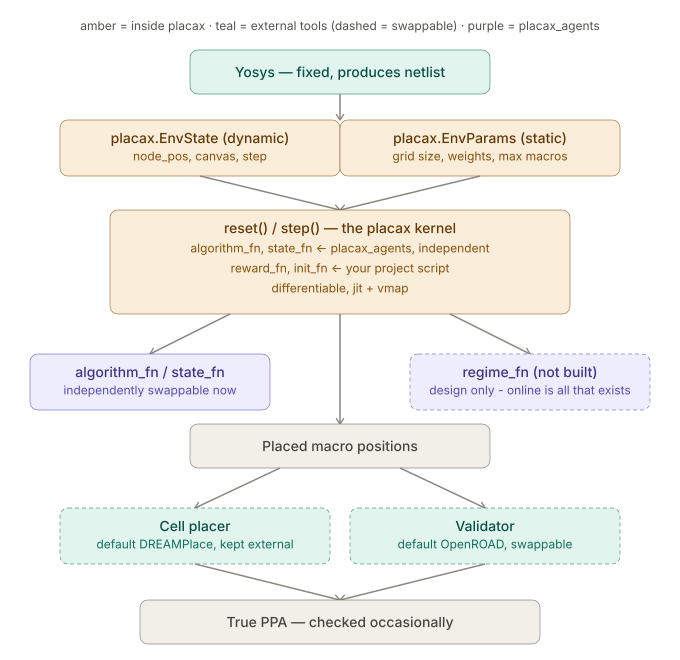

<h1 align="center">
    <picture>
        <source media="(prefers-color-scheme: dark)" srcset="assets/logo_dark.svg">
        <source media="(prefers-color-scheme: light)" srcset="assets/logo_light.svg">
        
    </picture><br>
    <b>A fast, shared JAX environment for chip macro placement research</b>
</h1>

<p align="center">
  <a href="https://pypi.python.org/pypi/placax"></a>
  <a href= "https://badge.fury.io/py/placax"></a>
  <a href= "https://github.com/paulin-dev/placax/blob/master/LICENSE.md"></a>
</p>

This is the detailled description


GitHub desc: A shared, differentiable JAX environment for chip macro placement


## Architecture



## Getting Started

```sh
pip install placax
```

## Training (MaskPlace pipeline)

```sh
python scripts/run_maskplace.py --benchmark_dir=benchmarks/adaptec1 --n_iterations=300 --n_episodes=10 --eval_every=5 --placement_images --patience=10
```

- `--benchmark_dir`: path to a downloaded benchmark (see `scripts/download_benchmarks.py`); default `benchmarks/adaptec1`.
- `--n_iterations`: number of buffered-PPO update cycles to run; default `100`.
- `--macro_budget`: place only the N most important macros (MaskPlace's `--pnm`); default `128`, MaskPlace's own value. Pass `all` to place every macro in the netlist instead - not yet verified to fit in memory or train well at that scale.
- `--n_episodes`: episodes collected per PPO update; default `10`, MaskPlace's own value. To find the largest value your GPU actually supports, use `scripts/subprocess_search.py` *separately first* (see below) rather than picking a number blind.
- `--log_every`: print a progress line to the console every this many iterations; default `1` (every iteration).
- `--eval_every`: compute real HPWL (a full extra greedy rollout, so not cheap) every this many iterations; default `10`.
- `--placement_images`: also write a placement snapshot PNG (`<benchmark_dir>/output_maskplace/placements/<iteration>.png` by default) - reuses the eval rollout that `--eval_every` already schedules, so it's free of extra rollouts; how many of those eval iterations actually get an image kept follows `--log_every`, not `--eval_every` (see `--placement_images_dir` to change where they're written).
- `--no_checkpoint`: don't read or write checkpoint.bin - a quick, disposable run that won't resume from or leave behind any state.
- `--patience`: stop early once real HPWL (per `--eval_every`) hasn't beaten its best value for this many consecutive evals; default `0` (disabled, always run the full `--n_iterations`).

Every iteration is appended to `<benchmark_dir>/output_maskplace/training_log.jsonl` regardless of `--log_every`, so the full history survives even if the console only shows a fraction of it.

Run `python scripts/run_maskplace.py --help` for the full flag list. The script auto-resumes from its checkpoint on re-run, so it's safe to stop and restart with the same flags.

### Finding the largest `--n_episodes` (or `--n_envs`) your hardware supports

`scripts/subprocess_search.py` sweeps a named flag across a list of candidate values, running the target script's own ordinary CLI once per value and stopping at the first one that doesn't fit - it deliberately imports nothing from placax/jax itself, so it can probe accurately without competing with its own subprocesses for GPU memory (see that module's docstring for why that matters). No cooperation is required from the target script:

```sh
python -m scripts.subprocess_search scripts.run_maskplace '--n_episodes=[1,2,4,8,10]' \
    --benchmark_dir=benchmarks/adaptec1 --macro_budget=128 --eval_every=1 --n_iterations=4 --no_checkpoint
```

Prints `RESULT=<largest value that worked>` - pass that as `--n_episodes` to the real training run. The same tool works for `scripts/run_training.py`'s `--n_envs`, or any other script following the same plain-CLI convention.

`--eval_every=1`/`--n_iterations=4` here deliberately don't match the real run's `--eval_every=10`: the eval rollout is a separately-compiled executable with its own memory footprint, so a probe needs to cross at least one eval boundary (plus a couple more iterations, to catch ordinary GPU allocator fragmentation drift) to be representative - forcing it every iteration reaches that footprint by iteration 1 instead of iteration 10, so 4 iterations suffice instead of 13. Trade-off: JAX's allocator can behave slightly differently depending on the exact iteration pattern (eval every iteration vs. only every 10th), so this is a faster but marginally less exact stand-in for the real run's precise allocator history.