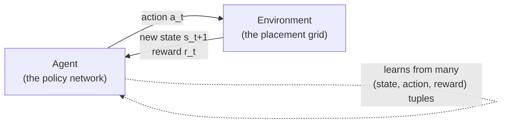
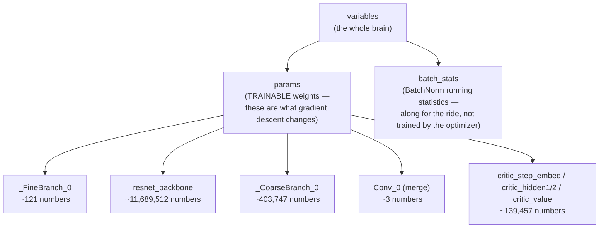
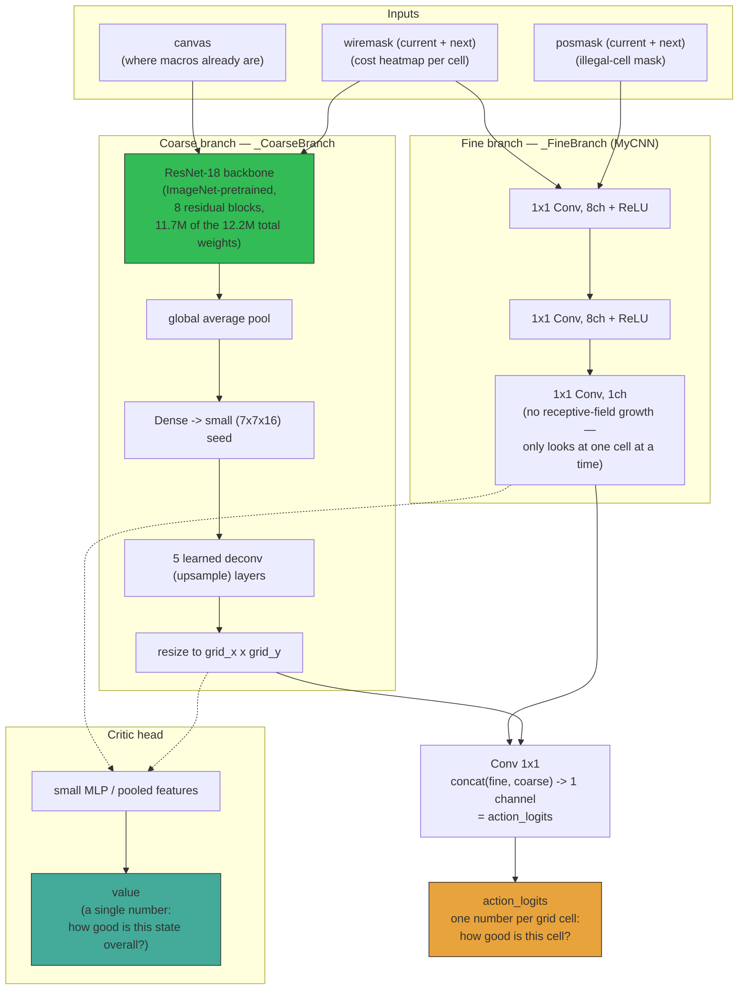
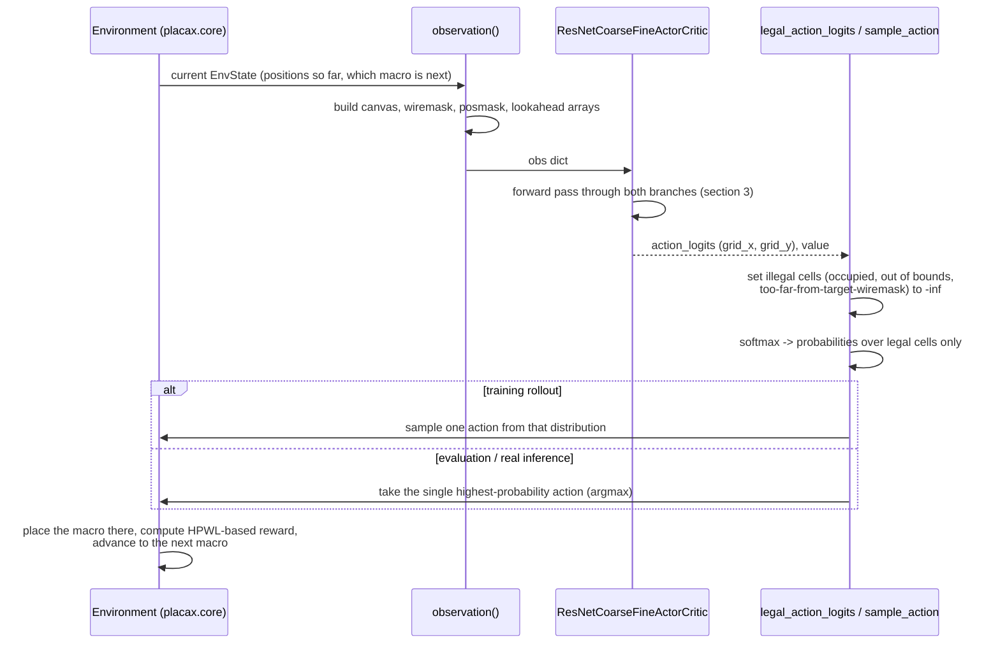
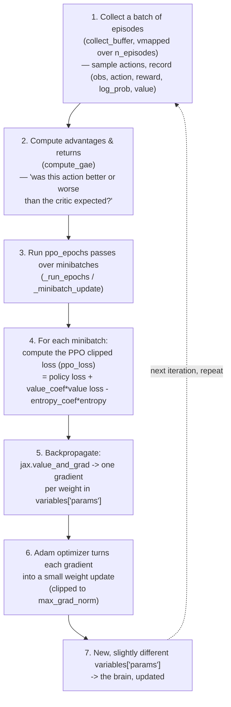
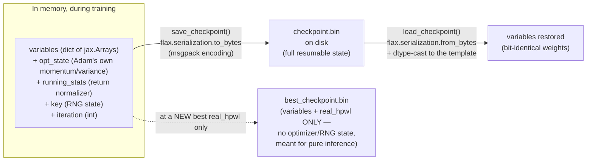
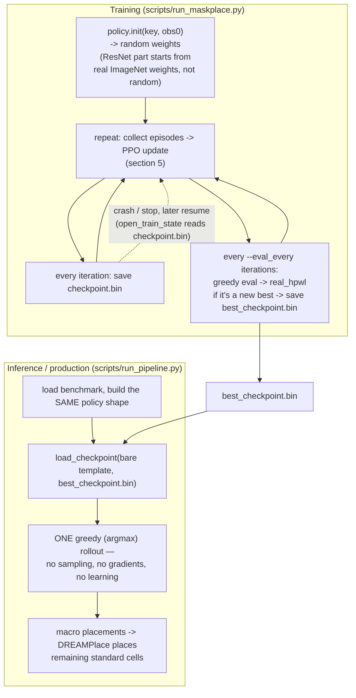

# How the RL Agent Learns — A Guided Tour of `placax`'s MaskPlace Brain

This document explains, from first principles and grounded in this repo's actual code, how
reinforcement learning (RL) works, what our MaskPlace agent's "brain" physically is, how it makes a
placement decision, how it learns from experience, and where that brain lives on disk between runs.

---

## 1. The RL loop, in general

Reinforcement learning has one core loop: an **agent** looks at a **state**, picks an **action**, the
**environment** reacts and hands back a **reward** and a **new state**. Repeat until the episode ends.
Over many episodes, the agent adjusts its own decision-making so that future rewards get bigger.

Three ingredients make this concrete for a given problem:

| Ingredient | Generic RL | Our MaskPlace agent |
|---|---|---|
| **State** | Whatever the agent can observe | Canvas so far + wiremask heatmap + legality mask + next-macro preview |
| **Action** | A choice from some action space | Pick one grid cell `(x, y)` to place the current macro |
| **Reward** | A scalar signal, higher = better | Negative HPWL delta (wirelength got shorter = positive reward) |

One **episode** = placing every macro of a netlist, one at a time, until none are left
(`placax/core.py::reset`/`step`). One **iteration** of training = collecting a batch of such episodes,
then updating the network's weights once from that batch.

---

## 2. What is "the brain," physically?

The agent's entire decision-making ability lives in a big pile of **numbers**: the weights of a
neural network. There is no symbolic rule like "if a macro is large, place it in the corner" written
anywhere — every behavior the agent has is the *emergent result* of millions of floating-point numbers
that got nudged, gradient step by gradient step, until they happen to produce good placements.

Concretely, in this codebase the brain is a Python/JAX object called `variables`: a nested dictionary
of arrays (a "pytree" in JAX terminology). It has exactly two top-level parts:

(Those parameter counts are real, measured directly from this project's own policy —
`ResNetCoarseFineActorCritic`, `placax_agents/policy/architectures/resnet_cnn.py`.) The whole thing is
about **12.2 million numbers**. The overwhelming majority of them (95%+) belong to the ResNet-18
backbone alone.

**"Learning" = changing these numbers a little bit, repeatedly, in a direction that makes rewarded
actions more likely and unrewarded ones less likely.** Nothing else about the agent changes between a
freshly initialized run and a fully trained one — same code, same architecture, same shapes. Only the
*values* inside `variables["params"]` differ.

---

## 3. The network architecture: two branches, one decision

The policy is `ResNetCoarseFineActorCritic`. It looks at the current state from two angles at once —
a *fine*, purely local view, and a *coarse*, wide-context view — and merges them into one logit per
grid cell (how attractive that cell is for the current macro). A separate small head estimates the
*value* of the current state (used only during training, to judge whether an action outperformed
expectations).

Why two branches? The **fine** branch reacts to local detail (is *this specific* cell physically free
right now), while the **coarse** branch — via the ResNet — gives the network a sense of the *whole
canvas's* shape and congestion, the way a human glances at the full floorplan before deciding where a
big macro should roughly go. This mirrors MaskPlace's own two-branch design (`MyCNN` + `MyCNNCoarse`
in the original paper's `PPO2.py`).

---

## 4. From a raw state to one placement decision

Two files do the heavy lifting here: `placax_agents/policy/observation.py` (state → network input) and
`placax_agents/policy/action.py` (`legal_action_logits`, `sample_action`, `action_log_prob`). Sampling
(used during training rollouts, via `collect_rollout` in `placax_agents/training/rollout.py`) injects
exploration — the agent sometimes tries a *not-currently-favorite* cell, which is exactly how it can
ever discover better strategies. Argmax (used in `placax_agents/ops/evaluate.py::evaluate`, and in
production inference) is fully deterministic: same weights, same state, always the same placement.

---

## 5. How the numbers actually get updated: one PPO training iteration

This is the "learning" step. It happens once per training **iteration**, after collecting a batch of
episodes.

The **PPO clipped objective** is what keeps this stable: it increases the probability of actions whose
advantage was positive (better than the critic expected) and decreases it for negative-advantage
actions, but *clips* how far any single update can push a probability ratio, so one noisy batch can't
swing the weights wildly. `entropy_coef` adds a small bonus for keeping the action distribution spread
out (more exploration, less premature overconfidence); `gamma`/`lam` control how rewards get discounted
and smoothed across a whole episode (`placax_agents/training/algorithm/config.py::PPOConfig`,
`gae.py`, `loss.py`).

**Only `variables["params"]` gets trained.** `variables["batch_stats"]` (the ResNet's BatchNorm
statistics) is deliberately excluded from the optimizer — it's tagged as a "frozen collection" in
`placax_agents/training/algorithm/optimizer_step.py::apply_gradient_update` and simply passed through
each step unchanged by gradient descent (it does still get *recomputed live* on every forward pass, per
the September 2026 BatchNorm fix — but that recomputation isn't "learning," it's just normalization
math, not weights being nudged by a gradient).

---

## 6. Where the brain lives between runs: checkpoints

In memory, `variables` is just a Python object that vanishes the moment the process exits. To survive
across runs (or hand a trained policy to a completely different script), it has to be written to disk.

Two files, two purposes (`placax_agents/ops/checkpoint.py`, `placax_agents/training/loops/common.py`):

- **`checkpoint.bin`** — the *full* resumable training state: weights, the Adam optimizer's own
  internal momentum, the RNG key, the iteration counter. Written every single iteration
  (`checkpoint_every_n`), so a crash never loses more than one iteration of progress. This is what
  `--n_iterations` resumption reads.
- **`best_checkpoint.bin`** — just the weights (`variables`) plus the `real_hpwl` they achieved, saved
  only when a new best evaluation score is reached. This is the file meant for **production inference**
  (`scripts/run_pipeline.py`, `scripts/place_once.py`): load these weights, run a single greedy
  (argmax) rollout, done — no optimizer, no training loop, no further learning involved at all.

The file itself is a flat binary blob (msgpack-encoded arrays) — there is nothing "readable" in it by
eye, but structurally it is exactly the `variables` pytree from section 2, byte for byte.

---

## 7. Putting it all together: the full lifecycle

The key mental model: **training is the only phase where the brain changes.** Everything downstream
of a saved checkpoint — evaluation, visualization, the production pipeline — loads those exact numbers
and just *runs the forward pass once per macro*. There's no learning happening at inference time, only
at training time; the network's *behavior* (how live BatchNorm statistics get computed per forward
pass) is identical in both phases, but the *weights* are completely frozen outside of training.

---

## Glossary

| Term | Meaning here |
|---|---|
| **Policy** | The network that outputs `action_logits` — decides *what to do*. |
| **Value function / critic** | The (smaller) network that outputs `value` — estimates *how good the current state is*, used only to compute advantages during training. |
| **Weights / parameters** | The actual numbers (`variables["params"]`) that gradient descent adjusts. This *is* the brain. |
| **`batch_stats`** | BatchNorm's per-channel running mean/variance inside the ResNet backbone — not trained by the optimizer, recomputed live each forward pass. |
| **Logit** | A raw, pre-softmax score. Higher logit = more attractive action, before converting to a probability. |
| **Advantage** | "How much better was this action than what the critic expected?" — the signal PPO actually optimizes. |
| **Episode** | One full placement of every macro in the netlist, start to finish. |
| **Iteration** | One PPO update: collect a batch of episodes, then update the weights once. |
| **Checkpoint** | A file on disk holding a snapshot of `variables` (and, for the full one, the rest of the resumable training state). |
| **Rollout** | The act of running the policy through an episode, either by sampling (training) or by argmax (evaluation/inference). |
