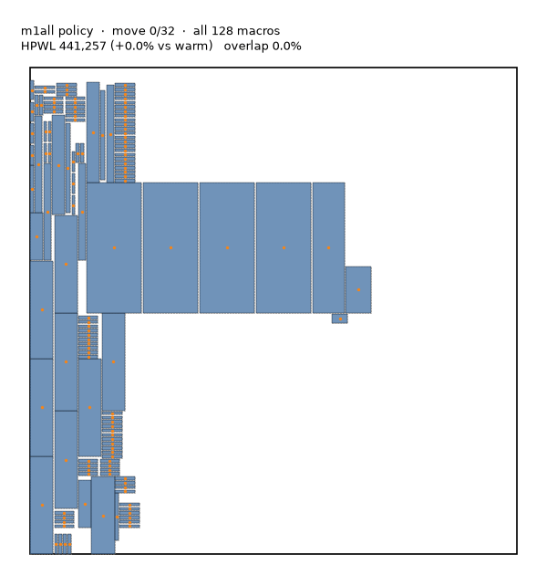
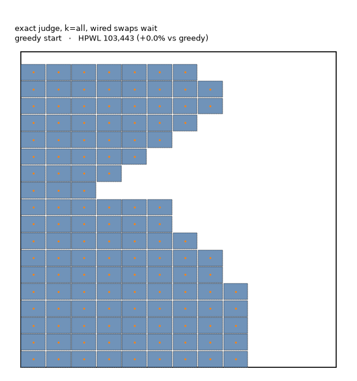
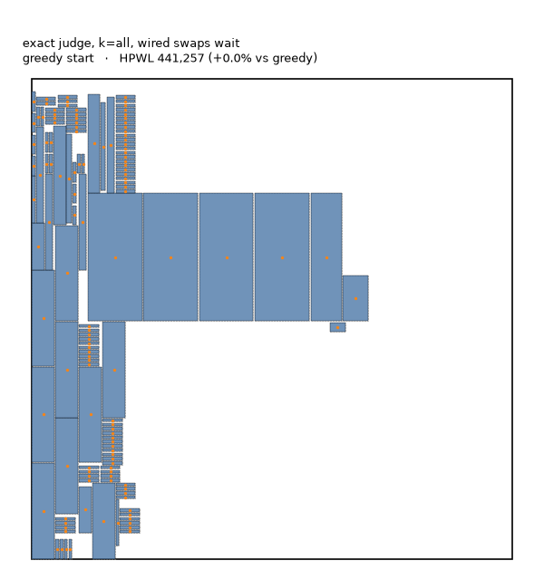
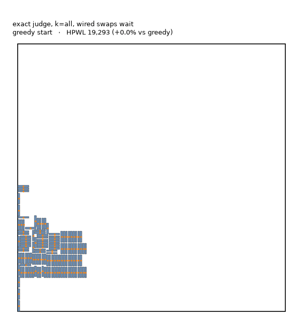

# Supplementary material: animations

Companion to [**paper.pdf**](paper.pdf), *Can Macros Place Themselves? Decentralized Agents and
Leaderless Swaps for Macro Placement Refinement*. The paper shows still frames (Fig. 2, Fig. 7a);
the full animations are below. Every animation is one frame per step or per round, generated from
the runs by `multiagent/paper/build.py` (see Appendix C of the paper).

**How to read a frame.** Blue blocks are macros. Red blocks overlap another macro, which the
legalizer must resolve. Purple blocks just traded places with the block they are linked to.
Dashed outlines and orange lines show each macro's greedy starting position and how far it has
moved from it.

## S1. Nudging agents (Section 5.1)

One deterministic episode of the shared policy on adaptec1 (m1all view, overlap penalty
λ_o = 3): all 128 macros move at once for 32 steps, each by at most one grid cell, then the
placement is legalized.

## S2. The swap swarm on the densest design (Section 5.6, Fig. 7a)

ariane133: 128 identical SRAM blocks covering half the canvas. The exact judge with conflict
resolution (Algorithm 1). Left: every same-footprint macro is a candidate (+35.3% in 47 rounds).
Right: only the 8 nearest same-footprint macros are candidates (+15.5%). Good trading partners
are rarely adjacent.

| All candidates | 8 nearest candidates |
|---|---|
|  |  |

## S3. Why conflict resolution is needed (Section 5.6, Fig. 7b)

adaptec1. Left: every agreed swap is applied at once. The four large macros share wires, each
pair scored its swap assuming the others would not move, and they exchange back and forth
(−15.1%). Right: a swap waits when a wired partner is part of a better swap in the same round.
Three swaps in one round give +18.1%.

| All agreed swaps at once | Wired swaps wait |
|---|---|
|  |  |

## S4. The swap swarm on a sparse design

bigblue1 (3.5% of the canvas covered): +44.4% in 32 rounds, equal to the central swap search.

## S5. Nudges, then swaps (Section 5.6, Table 2)

adaptec1: the agents' 32 nudge steps, legalization, then the swap swarm. +25.8%, the best result
on the training design.

